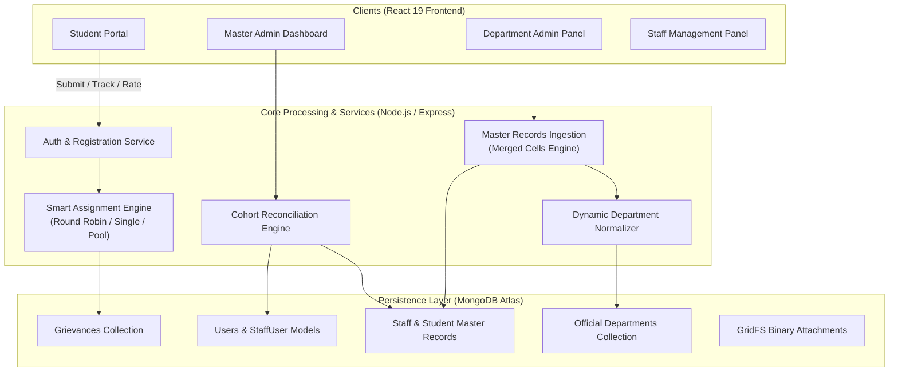

# 🎓 CT University Grievance Management & Institutional Administration Portal

An enterprise-grade, full-stack **Campus Grievance Management, Smart Routing, & Master Records Verification System** built for modern universities. The platform integrates automated ticket routing, multi-departmental administrative workflows, Excel-driven master records reconciliation, dynamic department normalization, and live user role governance.

---

## 📑 Table of Contents

- [Architectural Overview](#-architectural-overview)
- [System Features](#-system-features)
  - [1. Student Grievance Portal](#1-student-grievance-portal)
  - [2. Smart Assignment Engine](#2-smart-assignment-engine)
  - [3. Excel Master Records & Merged Cells Engine](#3-excel-master-records--merged-cells-engine)
  - [4. Teaching (Faculty) vs Non-Teaching (Admin) Separation](#4-teaching-faculty-vs-non-teaching-admin-separation)
  - [5. Dynamic Zero-Hardcoding Department Normalizer](#5-dynamic-zero-hardcoding-department-normalizer)
  - [6. Live Registered Users Management](#6-live-registered-users-management)
  - [7. Records vs Registered Reconciliation Engine](#7-records-vs-registered-reconciliation-engine)
  - [8. Security, Roles & Master Admin Governance](#8-security-roles--master-admin-governance)
- [Technology Stack](#-technology-stack)
- [Repository Structure](#-repository-structure)
- [API Endpoints Reference](#-api-endpoints-reference)
- [Installation & Setup](#-installation--setup)

---

## 🏛️ Architectural Overview



---

## 🌟 System Features

### 1. Student Grievance Portal
- **Departmental Ticket Submission**: Students can file grievances across all university departments (Accounts, Admission, Examination, Student Welfare, Transport, HR, CRC Placements, Student Section, and Academic Schools).
- **Guaranteed "Others" Fallback**: Every department includes a system-protected (`isSystemReserved: true`) fallback category for unclassified inquiries.
- **Evidence & File Attachments**: Supports direct document and media uploads via MongoDB GridFS streaming.
- **Real-Time Lifecycle Tracking**: Live grievance state monitoring:
  - `Pending` $\rightarrow$ `Assigned` $\rightarrow$ `Resolved` or `Rejected`
- **Mandatory Feedback & Star Rating**: Resolving a grievance triggers a mandatory 1–5 star rating mechanism. Ratings below 3 stars require qualitative feedback reasoning to enforce institutional accountability.

---

### 2. Smart Assignment Engine
Automated departmental routing engine supporting three distinct operational modes:
1. **Single Assign (Primary Specialist)**: Automatically dispatches new tickets to the designated primary staff member.
2. **Round Robin (Workload Balancing)**: Sequentially cycles grievance assignments among active team members to eliminate bottlenecks.
3. **Pool Accept (Queue Claim)**: Places complaints into a shared departmental queue where authorized staff claim tickets on a first-come, first-served basis.
- **Dynamic Warning Indicators**: Visual indicators highlight categories lacking active routing configurations to alert administrators.
- **Customizable SLAs & Deadlines**: Default 7-day resolution deadlines with extensions requesting and approval workflows.

---

### 3. Excel Master Records & Merged Cells Engine

Uploading institutional records often involves complex Excel spreadsheets where departments or designations are vertically merged across multiple staff rows. Standard Excel-to-JSON utilities leave lower rows blank (`null`), causing data integrity loss.

#### 🔧 Merged Cells Expansion Algorithm (`fillMergedCells`)
Before converting Excel sheets to JSON, the ingestion engine inspects `sheet['!merges']`:
```javascript
// Propagates top-left cell values into all cells across the merged range
export const fillMergedCells = (sheet) => {
  if (!sheet || !sheet["!merges"] || !Array.isArray(sheet["!merges"])) return;
  for (const merge of sheet["!merges"]) {
    const startCellAddress = xlsx.utils.encode_cell(merge.s);
    const cellValue = sheet[startCellAddress];
    if (!cellValue) continue;

    for (let r = merge.s.r; r <= merge.e.r; r++) {
      for (let c = merge.s.c; c <= merge.e.c; c++) {
        if (r === merge.s.r && c === merge.s.c) continue;
        sheet[xlsx.utils.encode_cell({ r, c })] = { ...cellValue };
      }
    }
  }
};
```
- **100% Data Preservation**: Guarantees that every staff member in a merged group (e.g., 10 staff under "Accounts") retains their department.
- **Three Ingestion Modes**:
  - `add`: Incremental upsert matching on Unique ID.
  - `change`: Atomic database reset and fresh batch replacement.
  - `remove`: Targeted bulk deletion of matching IDs present in the spreadsheet.

---

### 4. Teaching (Faculty) vs Non-Teaching (Admin) Separation

The platform establishes an end-to-end distinction between **Teaching Staff (Faculty)** and **Non-Teaching Staff (Admin / Departmental Staff)**:

- **Sheet Tab Auto-Detection**:
  - Worksheets named `Faculty` or containing `teach`, `academic`, or `prof` are automatically classified as `staffType: "Teaching"`.
  - Worksheets named `Admin` or containing `non-teach`, `staff`, or `office` are tagged as `staffType: "Non-Teaching"`.
- **Database Synchronization**:
  - `StaffRecord`, `StaffUser`, and `User` models maintain `staffType: { type: String, enum: ["Teaching", "Non-Teaching"], default: "Non-Teaching" }`.
  - When staff register on the portal, their category is automatically linked from master records.
- **Dual-Cohort Dashboards**:
  - Dedicated sub-filters for **Teaching (Faculty)** and **Non-Teaching (Admin)** with dynamic count pills.
  - Distinct visual badges across tables and mobile cards without disruptive emojis.

---

### 5. Dynamic Zero-Hardcoding Department Normalizer

Spreadsheet uploads and manual entries routinely introduce typos, varying capitalizations, multiple spaces, and symbol variations (e.g., `&` vs `and`). 

#### 💡 Solution: `departmentNormalizer.js`
The normalizer uses generic, mathematical string normalization rules without hardcoding any specific department names:

```
"School of Design & Innovation"        \
"School of Design and innovation"        \
"School of Design&Innovation"             ===> Canonical Key: "school of design and innovation"
"School of Design  &  Innovation"        /    ===> Matches Official DB: "School of Design and Innovation"
"school of design and innovation"       /
```

- **Spacing-Agnostic Ampersand Matching**: The regular expression `\s*&\s*` normalizes `&xyz`, `& xyz`, and ` & ` into a standard ` and ` key.
- **Automatic Whitespace Collapsing**: Collapses multiple spaces and trims boundaries (`\s+` $\rightarrow$ ` `).
- **Official Database Mapping**: Dynamically fetches active departments from `/api/departments` and binds raw variants to the official title-cased name.
- **Safe Unlisted Department Fallback**: Departments not yet in the official database (e.g., `Sports`, `Student Chapter`) are cleaned of redundant whitespace and preserved without data omission.
- **Flexible Backend Filtering**: Queries match using case-insensitive regex patterns (`new RegExp('^' + pattern + '$', 'i')`) so selecting an option finds all database variations.

---

### 6. Live Registered Users Management (`/admin/registered-users`)

Unified administration hub for reviewing and auditing verified institutional accounts:
- **Registered Students Tab**:
  - Detailed view of student ID, CTU ID, program, school, contact details, and OTP verification status.
  - Verification badge and account deletion controls.
- **Registered Staff Tab**:
  - Filterable by Category (`Teaching` vs `Non-Teaching`), Department, Role (`Staff` vs `Admin`), and Verification Status.
  - Dynamic KPI cards displaying live counts of total verified, faculty, administrative staff, and department heads.
  - Edit modal for updating personal details, assigned departments, and roles.
- **Adaptive Responsive Design**:
  - **Desktop View**: High-density interactive data table with inline editing and hover states.
  - **Mobile Compact View**: Zero-horizontal-scroll card layout displaying all metadata cleanly on smaller viewports.

---

### 7. Records vs Registered Reconciliation Engine (`RecordsComparisonTab`)

Provides institutional auditors with direct cohort reconciliation between Official Master Records and Live Registered Accounts.

- **Real-Time Audit Metrics**:
  - Total Official Master Records
  - Total Registered Portal Accounts
  - Unregistered Pending Cohort Count
  - Institutional Adoption / Registration Percentage Rate
- **Status Indicators**: Instant identification of `REGISTERED` vs `NOT REGISTERED` personnel.
- **One-Click Audit Export**: Generates timestamped `.xlsx` spreadsheets comparing official records against live registration data with applied department and status filters.

---

### 8. Security, Roles & Master Admin Governance

- **Role Hierarchy**:
  - `student`: Access to personal grievance dashboard and rating submission.
  - `staff`: Access to assigned ticket queue, extension requests, and resolution tools.
  - `dept_admin`: Oversight of department grievances, staff delegation, and routing rules.
  - `master_admin`: Global system authority, institutional configuration, and role delegation.
- **Master Admin Protection**: System master accounts (e.g., ID `10001`) are protected against accidental deletion or role demotion.
- **OTP Verification Security**: Two-stage activation ensures only verified student and staff accounts access internal services.

---

## 🛠️ Technology Stack

| Domain | Technology | Description |
| :--- | :--- | :--- |
| **Frontend** | React.js 19 | Component-driven UI architecture |
| | React Router DOM 7 | Client-side routing with protected route guards |
| | Vanilla CSS Design System | Custom glassmorphism, responsive grid, and zero-dependency styles |
| **Backend** | Node.js (v20+) | Asynchronous runtime environment |
| | Express.js 4 | RESTful API routing and middleware pipeline |
| | SheetJS (`xlsx`) | Binary workbook reading, merged cell manipulation, and exports |
| **Database** | MongoDB Atlas | Cloud document database |
| | Mongoose 8 | Object Data Modeling (ODM) with validation hooks |
| | GridFS | Native chunked binary streaming for grievance attachments |
| **Security** | JSON Web Tokens (JWT) | Stateless authentication |
| | Bcrypt.js | Cryptographic password hashing |

---

## 📁 Repository Structure

```
Grievance-Portal/
├── grievance-backend/
│   ├── config/             # DB connectivity & GridFS bucket setup
│   ├── controllers/        # Business logic:
│   │   ├── authController.js             # User registration & JWT auth
│   │   ├── grievanceController.js        # Grievance lifecycle & routing
│   │   ├── staffRecordController.js      # Staff Excel upload & merged cells
│   │   ├── studentRecordController.js    # Student master records upload
│   │   ├── registeredUserController.js   # Live registered users & audit comparison
│   │   └── departmentController.js       # Official departments & academic programs
│   ├── middleware/         # Token verification & role authorization
│   ├── models/             # Schemas: User, StaffUser, StaffRecord, StudentRecord, Grievance
│   ├── routes/             # Express route endpoints
│   └── server.js           # Server bootstrap, default seeding & error handling
│
├── grievance-frontend/
│   ├── src/
│   │   ├── components/     # UI modules:
│   │   │   ├── RegisteredStaffTab.jsx    # Live staff table & category filters
│   │   │   ├── StaffRecordsTab.jsx       # Staff master records & Excel importer
│   │   │   ├── RecordsComparisonTab.jsx  # Master vs. registered comparison engine
│   │   │   ├── RegisteredStudentsTab.jsx # Live students management
│   │   │   └── Icons.jsx                 # Custom lightweight SVG icons
│   │   ├── utils/          # Utilities:
│   │   │   └── departmentNormalizer.js   # Generic zero-hardcoding normalizer
│   │   ├── pages/          # Full-page dashboard views
│   │   ├── styles/         # Dashboard.css & design system tokens
│   │   └── App.js          # Route definitions & state wrappers
│   └── package.json
└── README.md
```

---

## 📜 API Endpoints Reference

### Master Records & Ingestion
| Method | Endpoint | Description |
| :--- | :--- | :--- |
| `POST` | `/api/staff-records/upload` | Upload staff Excel with merged cells expansion and Faculty/Admin tab detection |
| `GET` | `/api/staff-records` | Paginated staff records with `staffType` filter and category counts |
| `POST` | `/api/staff-records` | Manually insert a single staff record |
| `PUT` | `/api/staff-records/:id` | Update master record details and category |
| `DELETE` | `/api/staff-records/:id` | Remove a record from master database |

### Live Registered Users
| Method | Endpoint | Description |
| :--- | :--- | :--- |
| `GET` | `/api/registered-users/staff` | Fetch live staff with flexible department regex and `staffType` filter |
| `PUT` | `/api/registered-users/staff/:id` | Update staff role, department, or `staffType` |
| `DELETE` | `/api/registered-users/staff/:id` | Delete live staff account |
| `GET` | `/api/registered-users/compare` | Compare master records vs registered accounts (supports `.xlsx` export) |
| `GET` | `/api/departments` | Fetch active official university departments |

### Grievance Management
| Method | Endpoint | Description |
| :--- | :--- | :--- |
| `POST` | `/api/grievances/submit` | Submit grievance with optional GridFS file attachment |
| `GET` | `/api/grievances/category/:category` | Fetch grievances for a specific department |
| `PUT` | `/api/grievances/assign/:id` | Assign staff member and resolution deadline |
| `PUT` | `/api/grievances/update/:id` | Update status (`Resolved` / `Rejected`) |
| `POST` | `/api/grievances/rate/:id` | Submit student satisfaction star rating (1–5) |

---

## 🚀 Installation & Setup

### Prerequisites
- Node.js (v18 or higher)
- npm or yarn
- MongoDB Atlas database cluster

### 1. Backend Setup
```bash
cd grievance-backend

# Install dependencies
npm install

# Create environment configuration (.env)
PORT=5000
MONGO_URI=mongodb+srv://<username>:<password>@cluster.mongodb.net/grievancePortal
JWT_SECRET=your_jwt_private_key
EMAIL_USER=notifications@university.edu
EMAIL_PASS=your_email_app_password

# Launch backend with auto-reload
npm start
```
*Backend runs on `http://localhost:5000`.*

### 2. Frontend Setup
```bash
cd grievance-frontend

# Install dependencies
npm install

# Launch React development server
npm start
```
*Frontend runs on `http://localhost:3000`.*

---

## 📄 License

Distributed under the MIT License. Developed for CT University Grievance Administration.
